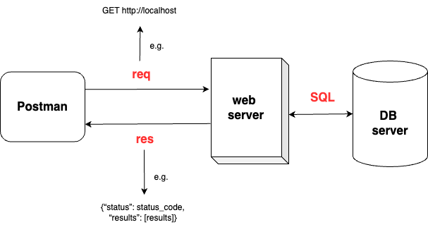
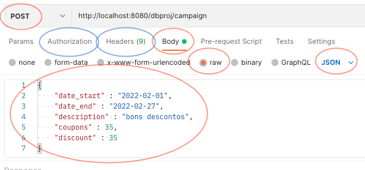

# Databases - Practical Assignment

The code and resources available in this repository are to be used only within the scope of the _BD 2024_ course of the Bachelor in Informatics Engineering.

The main purpose of this repository is to provide examples on how to do the initial setup of the database-centric REST API that must be developed for the assignment.

The system must be made available through a REST API that allows the user to access the system using HTTP requests (when content is required, JSON must be used). The followingfigure represents a simplified view of the system to be developed. As it is possible to see, the user interacts with the web server through the exchange of REST request/response and in turn the web server interacts with the database server through an SQL interface (e.g., Psycopg in the case of Python).

  

_The contents of this repository do not replace the proper reading of the assignment description._

## Demo [Python](python) REST API

To start this demo run the script [`python demo-api.py`](demo-api.py). This will launch a local web server with the coded endpoints. You can then make requests to the endpoints through HTTP (e.g., open your web browser and access http://localhost:8080/departments). To organize the interactions with the web server it is best to use an application; for this assignment you must use [`Postman`](https://www.postman.com/downloads/). Postman supports _collections_, which allows you to group requests (such as those that you will have to develop for the practical assignment). You can also import collections (such as the examples provided).

HTTP works as a request-response protocol. For this work, three main methods might be necessary:

- **GET**: used to request data from a resource
- **POST**: used to send data to create a resource
- **PUT**: used to send data to update a resource

In Postman you need to specify the type of the request when creating a new one. For POST/PUT requests, the data should be sent in the _body_ of the request, using the _raw_ format with _JSON_ as highlighted in the following screenshot. An example can also be found in the demo Postman collection made available.

  

For most of the endpoints it will also be necessary to pass an authentication token. You can define the token for each request in either the _Authorization_ or _Headers_ tab in Postman (which can also be seen in the previous image). 

The REST API must be developed to fulfil the functionalities/endpoints required for the practical assignment. You must also develop the database to support that application, which must be created in the PostgreSQL database that the web server connects to.

## Overview of the Contents
- [`python`](python) - Source code of web application template in python. It has template endpoints for the different types of requests (i.e., GET, POST, PUT) and how to interact with a PostgreSQL database server. This can/should be used as basis for the endpoints required for the practical assignment.
- [`postman`](postman) - An example of a collection of requests exported from the Postman tool. This collection is to be imported in the [Postman application](https://www.postman.com/downloads/).

## Requirements

To execute this project it is required to have installed:

- `python 3.X`
  - `psycopg2` (**conda install psycopg2-binary**)
  - `flask` (**conda install flask**)

## Support

If you find an issue or have questions regarding the demo feel free to contact me: [jrcampos@dei.uc.pt](mailto:jrcampos@dei.uc.pt)

## Authors

* BD 2023/2024 Team - https://dei.uc.pt/lei/
* University of Coimbra
